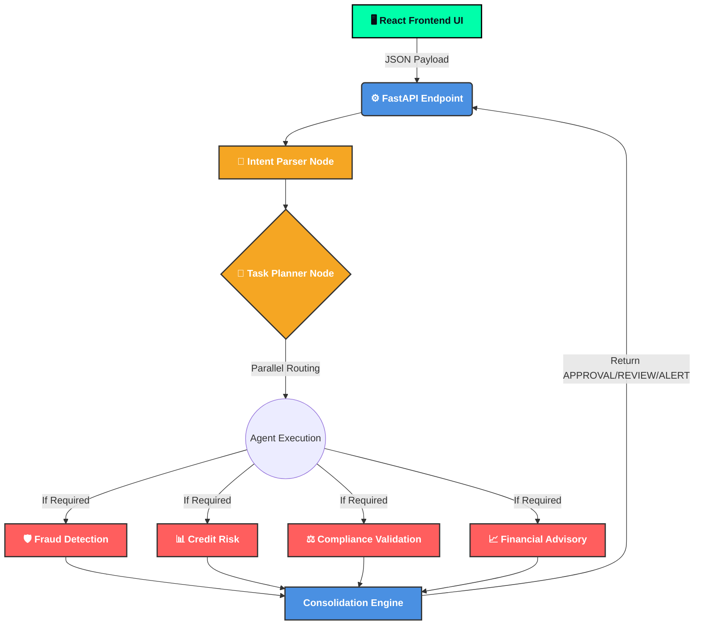
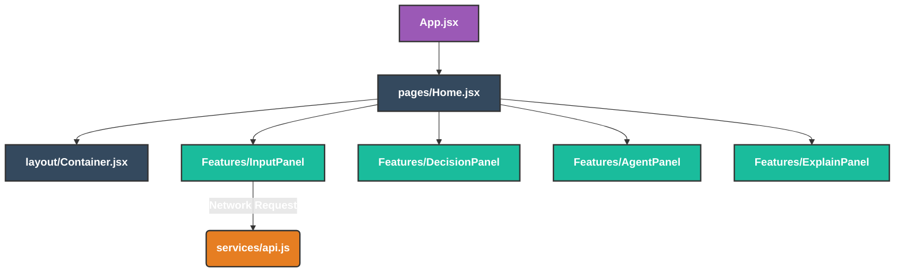

# FinAgent AI Orchestrator 🧠🚀

Welcome to the **FinAgent AI Orchestrator**, an advanced, state-of-the-art Multi-Agent Financial Intelligence System. Built with **LangGraph** and deployed via **FastAPI** with a truly customized Vanilla CSS **React** frontend. It leverages leading-edge **NVIDIA NIM APIs (LLaMA 3.1 8B Instruct)** alongside Real-time financial APIs and memory stores to autonomously orchestrate user intent into precision financial evaluations.

## 🌟 Key Features

1. **Multi-Agent Architecture (LangGraph + Python):** Architected a multi-agent AI system orchestrating dynamic routing for fraud detection, credit risk, compliance validation, and financial advisory modules.
2. **LLM Orchestration Layer:** Designed an advanced LLM orchestration layer relying on NVIDIA NIM (LLaMA 3.1) for routing based on user intent and transaction context. The decision engine consolidates multi-agent paths to output precise verdicts: **APPROVAL / REVIEW / ALERT**.
3. **Behavioral Fraud Detection:** Built an active algorithmic fraud detection component utilizing behavioral analytics (velocity, geo-patterns, and spending limits) coupled with explainable AI risk scoring metrics.
4. **Context-Aware RAG Advisory:** Integrated real-time market APIs (`yfinance`) with custom Retrieval-Augmented Generation (RAG) using FAISS vector stores to produce highly personalized, context-aware financial recommendations.
5. **Glassmorphism Bespoke UI:** A beautifully engineered dark-mode React interface running 100% Vanilla CSS, securely executing requests over the FastAPI decision endpoints.

---

## 🛠️ Technology Stack

**Backend System:**
* [Python 3.10+](https://www.python.org/)
* [FastAPI](https://fastapi.tiangolo.com/) & Uvicorn (Robust ASYNC execution layer)
* [LangGraph](https://python.langchain.com/docs/langgraph) (Cyclical execution and parallel nodes)
* [NVIDIA NIM AI Endpoints](https://build.nvidia.com) (Server-side LLM inference endpoints utilizing the highly optimized Meta Llama 3.1 model architecture).
* FAISS (Vector DB for Document RAG logic)
* yFinance (Direct pipeline for active real-time data)

**Frontend System:**
* [React](https://reactjs.org/) + Vite (Lightning-fast Dev environment)
* Custom Vanilla CSS (Frosted Glass aesthetics, variables, robust animation frames)

---

## 🏗️ Architecture Diagrams

### 1. LangGraph Multi-Agent Workflow
The backend relies on cyclic graphs computing state in parallel. The Orchestrator dictates routing via an LLaMA 3.1 planner.



### 2. React UI Component Structure
The frontend isolates UI layers into strictly decoupled Layouts, Features, and Services avoiding cyclic dependencies.



---

## 📂 Project Structure

```
.
├── finagent/                     # ⚙️ FASTAPI BACKEND ORCHESTRATION
│   ├── agents/                   # Individual LLM Nodes
│   │   ├── advisory_agent.py     # Live-Data & General Advice
│   │   ├── compliance_agent.py   # Sanctions and KYC Logic
│   │   ├── fraud_agent.py        # Velocity & Behavioral matching
│   │   └── risk_agent.py         # Financial evaluation
│   ├── orchestrator/          
│   │   ├── intent_parser.py      # LLM Information Extraction
│   │   └── task_planner.py       # LangGraph routing definitions
│   ├── data/                     # Vector knowledge & CSV storage
│   ├── graph.py                  # LangGraph Node configurations
│   ├── state.py                  # Pydantic State specifications
│   └── main.py                   # FastAPI Initialization point
└── finagent-ui/                  # 🖥️ REACT FRONTEND
    ├── src/
    │   ├── features/             # Form panels, Agent cards, Badges
    │   ├── layout/               # Global semantic container structural rules
    │   ├── pages/                # Home routing
    │   ├── App.css               # Component level scoped styling logic
    │   └── index.css             # Root level custom tokens and keyframes
    └── package.json    
```

---

## 🚀 Installation & Setup

Before starting, clone this repository locally and ensure you are using a macOS or Linux compatible terminal.

### 1. Backend Setup

Open a terminal and navigate to the backend service. Create your Python Virtual Environment and install the standard dependencies:

```bash
cd finagent
python -m venv finagent_env
source finagent_env/bin/activate
pip install fastapi uvicorn langchain langchain-core langchain-community langchain-nvidia-ai-endpoints pydantic yfinance faiss-cpu pandas python-dotenv
```

### 2. Configure Environment Tokens

Inside the `/finagent` directory, create a new local `.env` file containing your valid **NVIDIA API Key**.
```env
NVIDIA_API_KEY=nvapi-your-key-goes-here
```

### 3. Initialize the Databases
* Ensure that `data/ofac_sdn.csv` is present for AML mapping testing. You can populate it manually to test matching functionalities.
* Ensure `data/finance_docs.txt` is present to test standard RAG embeddings!

### 4. Run the Backend API

Start the live ASGI server via `uvicorn`:
```bash
uvicorn main:app --reload --host 0.0.0.0 --port 8000
```
*The Orchestrator will now be actively listening to `POST` JSON payloads to `http://127.0.0.1:8000/evaluate`.*

---

### 5. Frontend Setup

Open a new terminal session, navigate to the User Interface workspace, and install Node dependencies.
```bash
cd finagent-ui
npm install
```

Start the Vite development build:
```bash
npm run dev
```

The terminal will provide a localized URL (typically `http://localhost:5173`). Click it to launch your browser! 

### 🎉 Play Around
Input an organic query like *"I want to invest $200,000 into NVDA stock immediately from my account, but I also need to know if this large transfer affects my ability to get a mortgage next month given my $10,000 credit card debt."* 
Pass optional metrics into the UI layout form natively and see how the Orchestrator distributes decision trees simultaneously!
